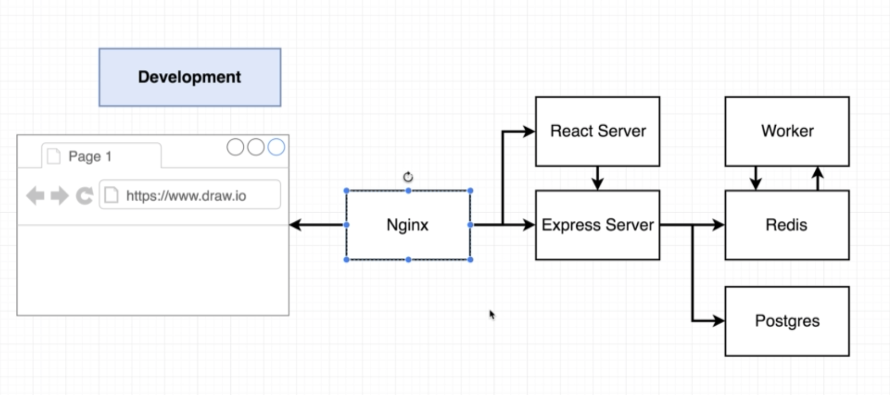
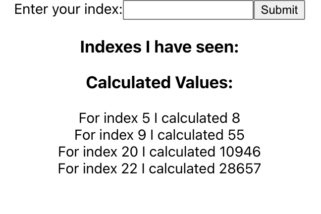
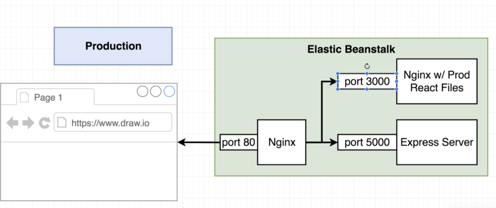

# docker-fib

The following repo consists of a multi container application having nginx as the proxy to access the upstream services.

nginx will reroute incoming traffic with path '/' to the react application, and with path '/api' to the express server.

the express server will make calls to the redis and postgres services. The redis service will offload the fib computation to the worker service.

each service is turned into a container using the docker-compose-dev file. the client, nginx, server and worker services have their own custom Dockerfile.dev. The redis and postgres containers simply pull the corresponding dockerhub image.

To run the application locally:

- navigate to the root directory
- run cmd: docker-compose -f docker-compose-dev.yml up --build

