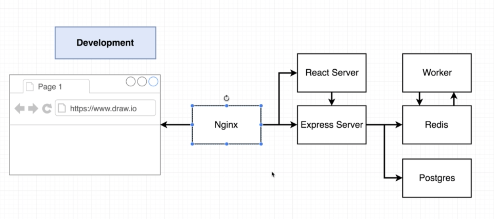
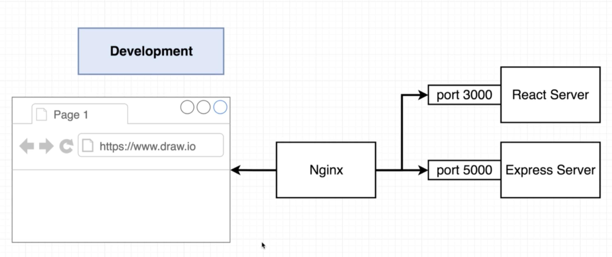
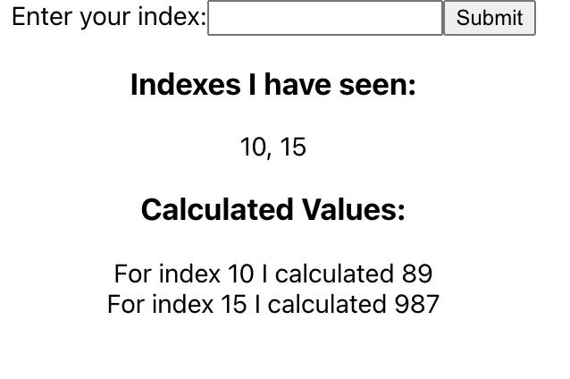
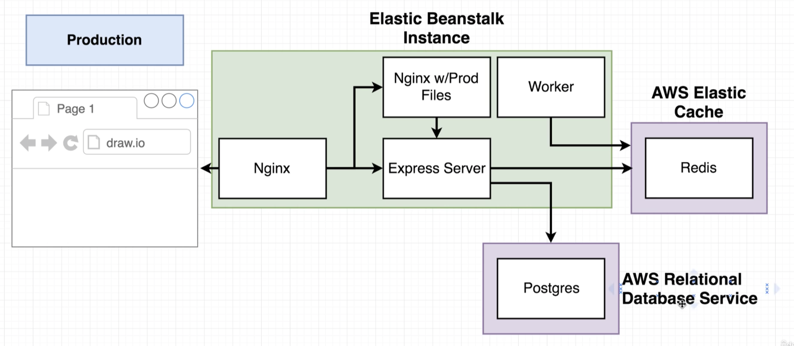
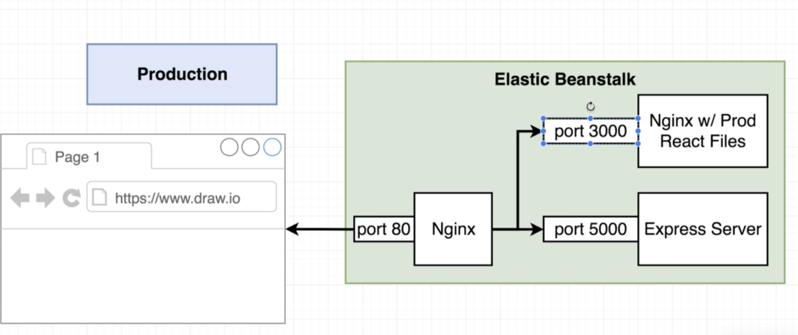

# docker-fib

The following repo consists of a multi container application having nginx as the proxy to access the upstream services.

nginx will reroute incoming traffic with path '/' to the react application, and with path '/api' to the express server.

the express server will make calls to the redis and postgres services. The redis service will offload the fib computation to the worker service.

## Development

each service is turned into a container using the docker-compose-dev file. the client, nginx, server and worker services have their own custom Dockerfile.dev. The redis and postgres containers simply pull the corresponding dockerhub image.

The nginx container will act as a proxy to route traffic from port 80 (port 3050 on host machine) to port 3000 (react server) or port 5000 (express server)

To run the application locally:

- navigate to the root directory
- run cmd: docker-compose -f docker-compose-dev.yml up --build
- navigate to localhost:3050

## Production

The images will be pushed to dockerhub and pulled into AWS ElasticBeanstalk. The express server will internally interact with AWS Elastic Cache which will have redis running. Redis will interact with the worker. The express application will also interact with AWS Relational Database Service (RDS) which will have postgres running.

An nginx proxy will route incoming traffic to port 3000 (nginx server hosting react build files) or port 5000 (express server).

CD pipeline description:

Travis:
- Build the ./client/Dockerfile.dev image
- Run tests by overriding the default command with "npm run test"
- If tests successfull, build all 4 images: 
    - ./client/Dockerfile
    - ./nginx/Dockerfile
    - ./server/Dockerfile
    - ./worker/Dockerfile
- Login into dockerhub and push all 4 images

ElasticBeanstalk:
- Pull the dockerhub images